```{r setup, include=FALSE}
knitr::opts_chunk$set(echo = TRUE)
library(knitr)
```

# {.tabset .tabset-pills} 

## First Time Set Up 
This section is adapted from Kate Miller and Sarah Wright's IMD Training on [Version Control](https://katemmiller.github.io/IMD_R_Training_Advanced/) 

### 1. Install Git
  Git is the software needed for this learning session.If you do not already have Git installed on your computer, please install before the session.  
  
  a. Open the **Software Center** application on your computer (this will allow you to download without admin approval)
  b. Navigate to the **Applications** tab 
  c. Click on **Git** 
  d. Click Install 
    
{width=500px}

If you're having issues installing Git, consult the [R Advisory Group Resources Sharepoint site](https://doimspp.sharepoint.com/sites/nps-nrss-imdiv/SitePages/R-Adv.aspx) and submit a helpdesk ticket if needed. 

### 2. Set Up a Github Account 

Go to [Join Github](https://github.com/join) to get started!

Username example: LpalaciosNPS or sam-olivares-mejia

You will need to verify your email to complete the joining process.

Once verified you will see the screen below. You don't need to personalize your account right away, click skip to reach your home screen.

{width=500px}

Your new home page will look like this

{width=500px}
</br></br></br>

**To Do: Once you've completed this step ** </br>
**Please email your username to Sam (samantha_olivares-mejia@partner.nps.gov)** so she can add you to our training github page! 

Still having trouble? This [Wiki How](https://www.wikihow.com/Create-an-Account-on-GitHub) gives in depth instructions. 

### 3. Open R Studio and install the `usethis` package 
  Remember, to install packages we use the install.packages() function. You can type this in the Console.
  
{width=600px, height=400px}


### 4. Navigate to **Tools > Global Options** 
  a. On the list on the left, click on GIT SVN
  b. Make sure the 'Enable version interface for RStudio project box is checked 
  c. Your screen should look like this (git.exe path may differ)

{width=300px}

  d. Click Apply then OK 
  
### 5. Create a Personal Access Token 
Your personal access token is used to connect your Github account to RStudio.

  a. run the code below in R Studio which will open a web browser to create a personal access token 
  
```{r MakeGHToken, eval=FALSE}
# This opens up a browser window where you can create a personal access token. It may ask you to log into GitHub or confirm your password.
usethis::create_github_token()
``` 
  
  b. once you've logged into GitHub your page will look like this 

{width=500px}

  c. enter 'RStudio' in the ***Note** field 
  d. set the **expiration** to a later date (I'd reccommend a year)
  e. scroll to the bottom and click **generate token** 
  f. this code will only generate once so make sure you **copy the personal access token to your clipboard**!!! 

### 6. Insert your personal access token in the Git Credential Store 
  a. run the code below and when prompted paste your personal access token 

```{ SetGHCreds, eval=FALSE}
gitcreds::gitcreds_set()
```

## Github Overview 

### Git vs. GitHub
Git/Github is a type of **version control** which is a way to save your progress in an organized manner. It allows you to keep track of your changes every step of the way, and allows for easy collaboration between teams. 

Git and Github are used interchangeably, however they are two sperate entities. 

  **Git** is the software you install on your computer 
  **GitHub** is an online interface for storing and collaborating with code.  

### Some terminology


```{r pushvpull, echo=FALSE, fig.align='center', out.width="50%"}
include_graphics("images/PushvPull.png")
```


## Branch and Clone Repository

### Branch 

First we are going to create a branch from main. To do this, go to the [SWNC Learning Github Repository](https://github.com/sam-olivares-mejia/SWNC_Learning_Github). 

If you've emailed Sam your GitHub username you should have contributor access to the repository. 

Click on the **main dropdown** in the upper left, and begin typing your name separated by underscores. Once complete, click on **'Create branch:*your name* from main'**. This will create your branch! 

```{r createbranch, echo=FALSE, out.width="30%"}
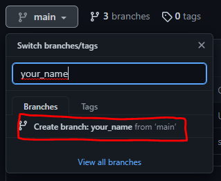
```

*Note: Typically we make branches to work on different sections of the code and name them accordingly (ex.'DataWrangling', 'Analysis'). This ensures that when developing the code, we are not editing the same sections in different branches at the same time which would create issues in merging the code later on.*

### Clone the Repository

1. Click on **code** in the upper right, and copy the HTTPS url provided. 

```{r CloneRepo, echo=FALSE, out.width="30%"}
include_graphics("images/CloneRepo.png")
```

2. Open R Studio and go to **File>NewProject>VersionControl>Git** 

```{r CloneRepoWorkflow, echo=FALSE, out.width="50%"}
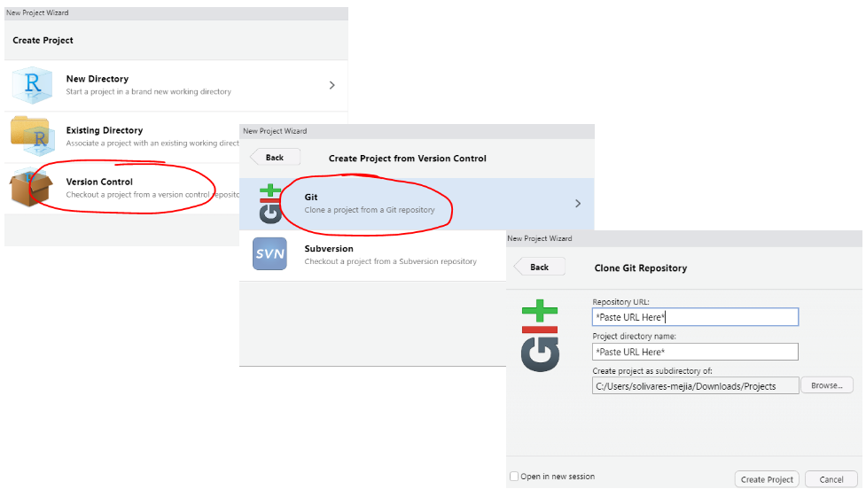
```

3. Paste the repository URL and click **Create Project**. Congrats- you have now cloned the repository to your local computer! 

### Open Branch 

To switch to your branch of the repository, navigate to the Git Panel in RStudio. It should be located in the upper right panel next to your environment. If it is not there you can go to **View >ShowGit** to view it.

Click the drop down menu in the upper right and select your branch name to switch to your branch!  

```{r SwitchBranches, echo=FALSE, out.width="50%"}
include_graphics("images/SwitchBranch.png")
```


## Stage and Commit


### Create a Markdown file 
We will create a new markdown file to add to the file structure by clicking file > New File > R Markdown.

```{r create, echo=FALSE, out.width="50%"}
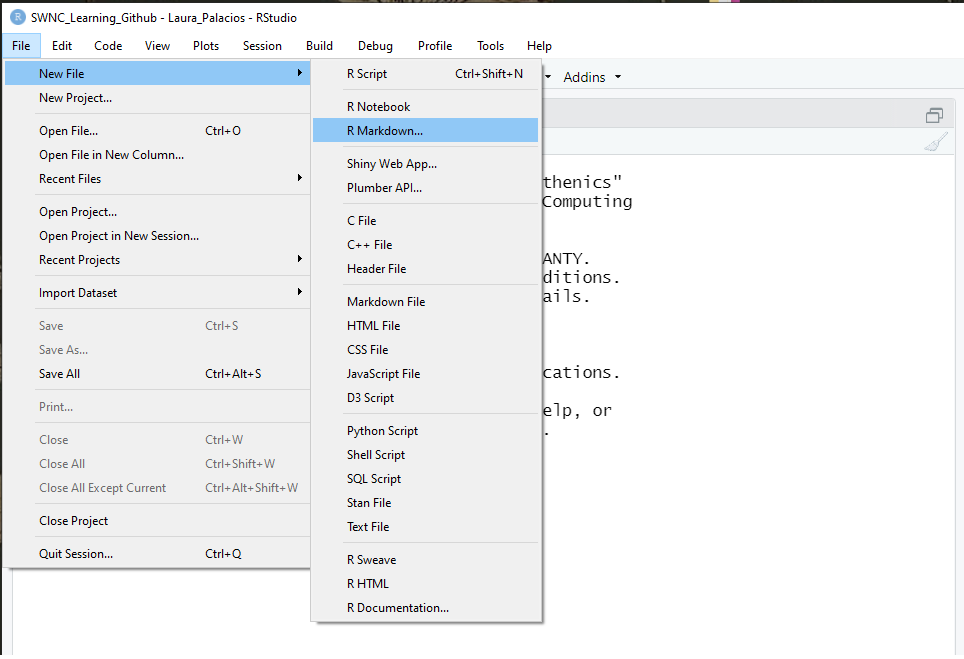
```


When prompted, enter FirstName_LastName as the title of your document. This will auto-poplate the green header block of your file.  All other options can be left as defaults. Click OK to create.

RMD files contain example code when they are created.We will keep the top block, but delete everything else (lines 11-30). 

Delete the code and replace with your own secret branch message.

```{r personalized, echo=FALSE, out.width="70%"}
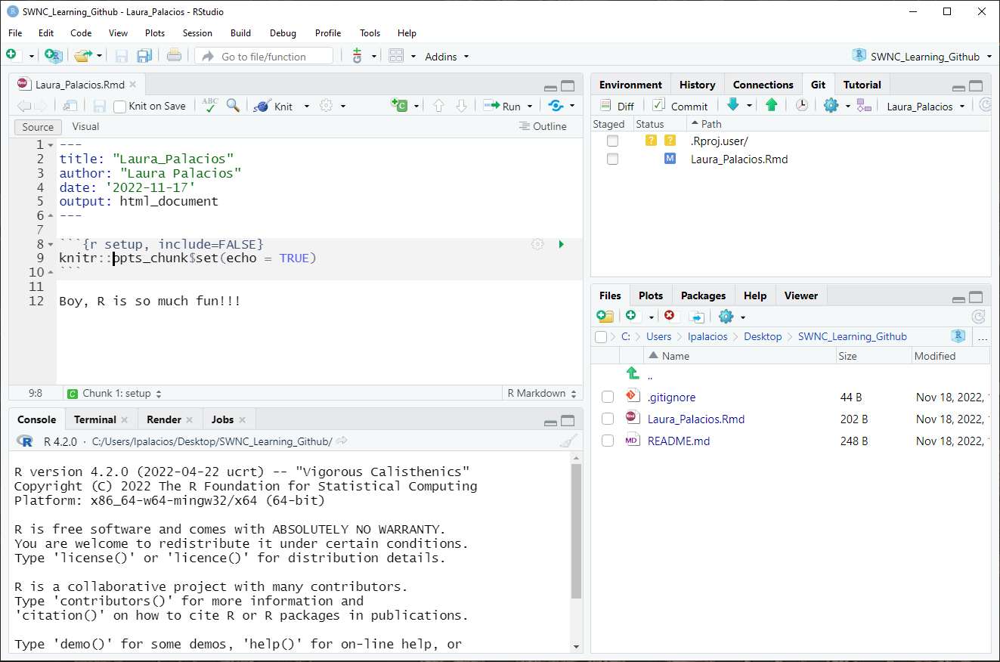
```

Save the changes in the default location (Rstudio will put the file where it is supposed to go) and enter YourFirstName_LastName as the file name.

```{r personalized2, echo=FALSE, out.width="70%"}
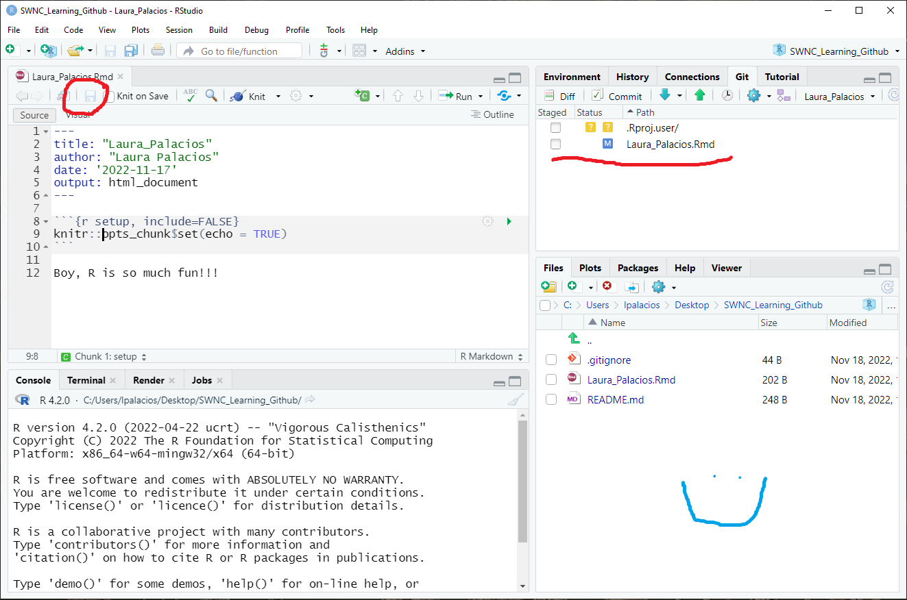
```


Navigate to the GIT tab in the upper right. Notice that your RMD file is now listed, with an ? icon to indicate that it has been modified in some way. Note that other back-ed files may also be present and can be ignored for this training.
```{r commitchanges1, echo=FALSE, out.width="70%"}
include_graphics("images/CommitChanges1.png")
```


### Stage 

Click the check box next to your new file. Notice that it is highlighted and the ? icon changes to an "A" for addition. Click the commit button.

```{r commitchanges2, echo=FALSE, out.width="70%"}
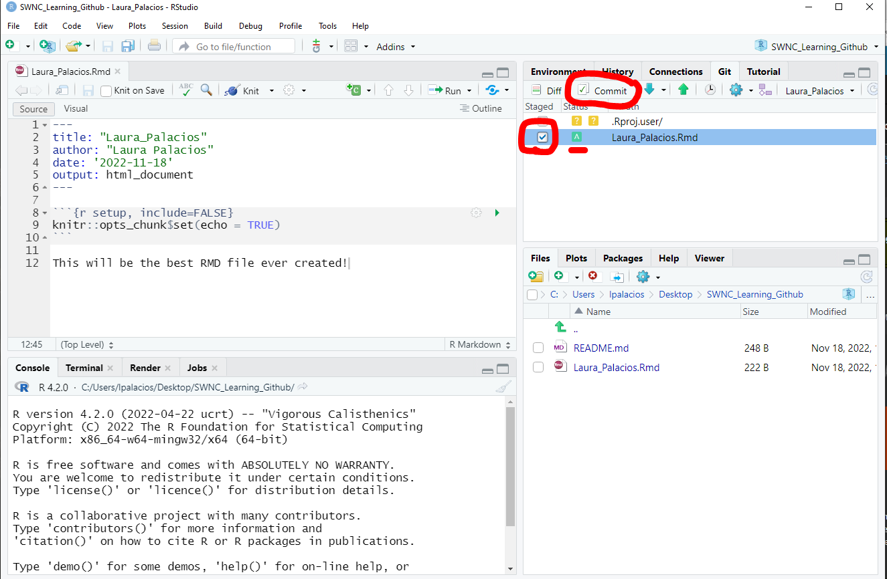
```


### Commit

A pop-up menu will show you a preview of what you are committing, allowing for you to make a final review.

Notice that the file previous is all green, to indicate additions. Other colors indicate other modifications.

Use the commit message box (requires entry) to describe the changes you have made. Note that anyone with access to the repository will eventually be able to see it.

Once your message is entered, press the commit button at the bottom of the message box.


```{r commitchanges3, echo=FALSE, out.width="70%"}
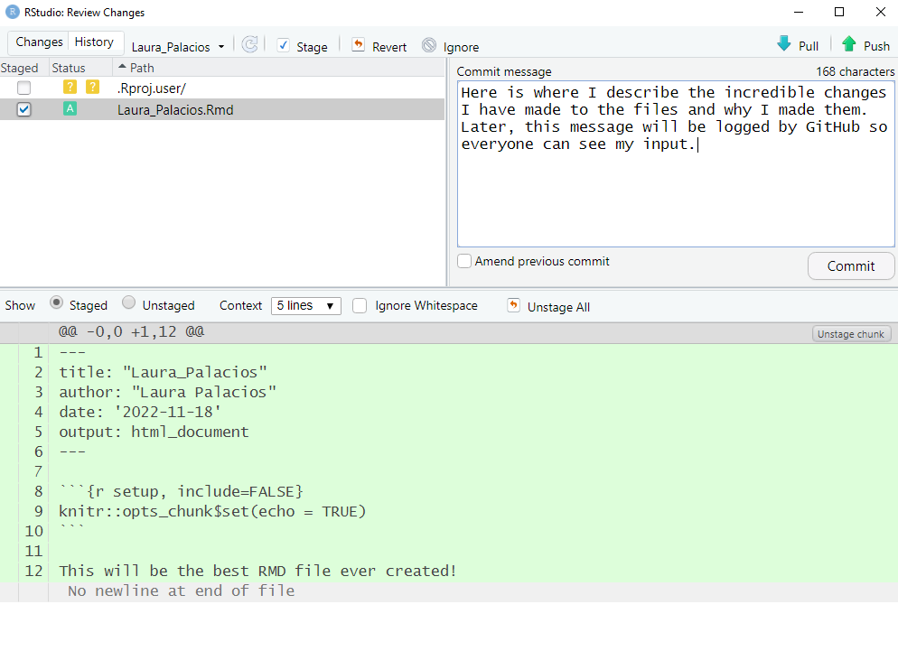
```

A wild popup appears!

This popup shows the status of your commit. If you have not configured your username, you may receive a message that Rstudio has automatically attributed your information. This is okay, we'll use the defaults for now.

What we want to see is the last two lines indicating that a file has been changed and listing your RMD file.

```{r commitmessage, echo=FALSE, out.width="50%"}
include_graphics("images/CommitMessage.png")
```


Return to your R studio. In the top left, you should see a note indicating that you have successfully committed a change and are now "ahead". This means that your version has changes that no one else can see. 

```{r commitreadytopush, echo=FALSE, out.width="50%"}
include_graphics("images/CommitReadytoPush.png")
```


But we want **Everyone** to be able to see your hard work!
This is where pushing and pulling comes in.

## Push + Pull 

### Push
Pushing means that you take your local changes and throw them into a magical world where everyone can see what you've created (GitHub).

Use the green arrow to push your changes. Note that this arrow is in multiple locations in R studio. All accomplish the same thing.

```{r Pushbuttons, echo=FALSE, out.width="60%"}
include_graphics("images/PushMyButtons.png")
```


Another popup should appear.

If you have had success, you will see a message like the one below.

Translation of the last line: 

you (HEAD) have pushed (->)to the branch (YourFirstName_LastName)

```{r successfulpush, echo=FALSE, out.width="60%"}
include_graphics("images/successfulPush.png")
```

Use your browser to navigate back to our GitHub Repo
[https://github.com/sam-olivares-mejia/SWNC_Learning_Github](https://github.com/sam-olivares-mejia/SWNC_Learning_Github)

Ensure that you're on your branch by clicking the branch dropdown menu and selecting your name.

```{r whatbranch, echo=FALSE, out.width="70%"}
include_graphics("images/WhatBranch.png")
```


When you change branches, you should be automatically directed to the home screen of the branch. If you were successful, you will see your commit message has been logged and your file now exists online, accessible to others.

Gold Stars if you've made it this far!!

```{r pushforsuccess, echo=FALSE, out.width="70%"}
include_graphics("images/PushForSuccess.png")
```

### Pull 
To pull data means that you take work that is on GitHub and bring it down locally to edit. (The opposite of pushing)

Pushing and pulling allow for collaboration between individuals in a shared space. For example, Laura can navigate to Sam's branch, pull her files down, edit her RMD, then push it back so Sam can access the newly changed file.

This is like Sharepoint or OneDrive, but with **more commitment**. Every time a user pushes changed files to GitHub, the changes are saved, but the old files still remain available as reference.

We will practice pulling and pushing by using another learner's branch. To avoid confusion from duplication, we will assign each of you a partner's branch to pull from. See the chat for your assignment.

Navigate to your user's branch using the branch dropdown menu (same as before). Make sure that you can see their RMD file. If you cannot, please let us know.

```{r whatbranch2, echo=FALSE, out.width="70%"}
include_graphics("images/WhatBranch.png")
```

Now we'll change our branch in R studio. Click the dropdown menu (likey populated with FirstName_LastName, indicating the branch you created.)

From the dropdown menu, click your partner's name.


```{r changebranch, echo=FALSE, out.width="70%"}
include_graphics("images/ChangeBranch.png")
```

## Merge 

As we learned earlier, a merge is used to combine your branches commits with main. 

```{r mergereminder, echo=FALSE, out.width="70%"}
include_graphics("images/merge.png")
```

When you're ready to merge the changes you made on your branch to the main, navigate to your branch's page on github. There will be a section on this page that tells you the status of your branch compared to the main. 

```{r BranchPage, echo=FALSE, out.width="50%"}
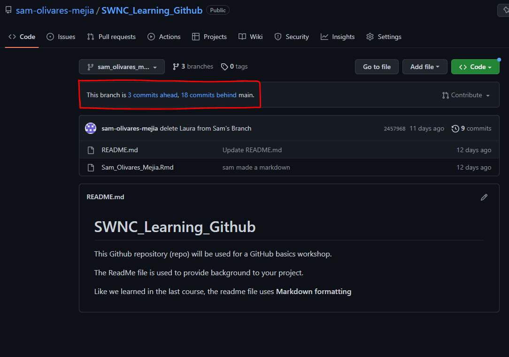
```

In the example above, our branch is 3 commits ahead, and 18 commits behind the main.This tells you that there are 3 changes your branch has that the Main doesn't have, and 18 commits the main has that your branch doesn't. Typically, your branch will have more commits 'ahead' vs 'behind' the main.

Below is an example to help visualize branches being 'ahead' or 'behind' the main. 

```{r aheadvbehind, echo=FALSE, out.width="70%"}
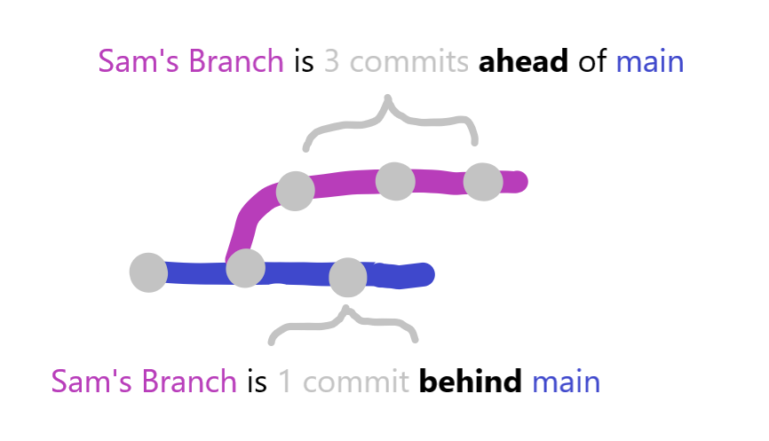
```

### Compare Changes  

To begin the merge process, click on the hyper linked text telling you how many commits ahead or behind your branch is. This will lead you to a **Comparing Changes** page. 

Lets break down this page. 

```{r pullrequest, echo=FALSE, out.width="90%"}
include_graphics("images/PullRequest.png")
```

Outlined in **red**, is the part of the page that tells you what branches you're comparing, and whether they are able to be merged automatically. In this example, the green text **Able to Merge** tells us that there are no merge conflicts that would cause issues during the merge. 

  - **Merge Conflicts** occur when two branches have sections that are not compatible with each other. This is why its important for each branch to be working on a different section or 'feature' of the code. 

Outlined in **blue**, is a summary of the commits in the branch. You can see how many commits were made, how many files were changed, and who contributed to the branch. Additionally you can also see the commit messages and the date they were each committed. 

Emphasized in **green**, is the **create pull request** button. Clicking this button will begin the review process to merge your branch into the main! 

### Open Pull Request 

GitHub will lead you to the **open a pull request** page. Here you can write messages to your collaborators letting them know you'd like to merge the branch into the main and elaborate on the branch's changes. Once you're ready to submit the request, click the **create pull request** button again.

```{r openpull, echo=FALSE, out.width="50%"}
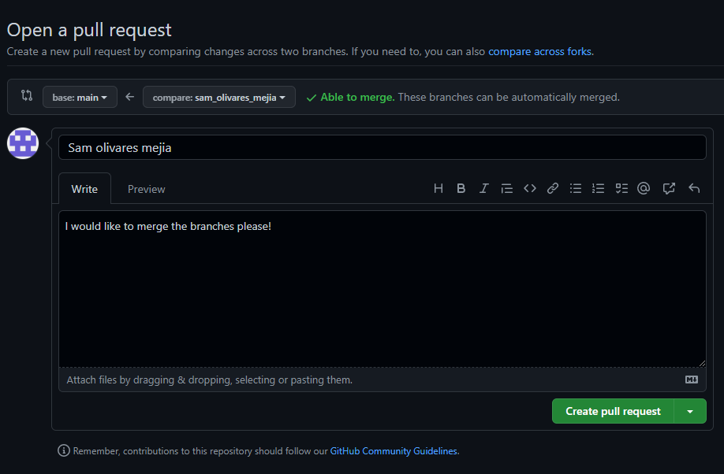
```


### Merge 

The final page before merging allows you to review the proposed merge with your collaborators. The conversation tab gives you a summary of the changes made, the ability to finalize the merge via the **merge pull request button**, and a place to add more comments or close the pull request. There are also other tabs that go into more detail on the commit and change history of your branch. 

```{r mergePage, echo=FALSE, out.width="90%"}
include_graphics("images/MergePage.png")
```

In a typical workflow, collaborators would discuss the commit history of the branch together before merging to the main to avoid confusion and merge conflicts. 


```{r mergeworkflow, echo=FALSE, out.width="110%"}
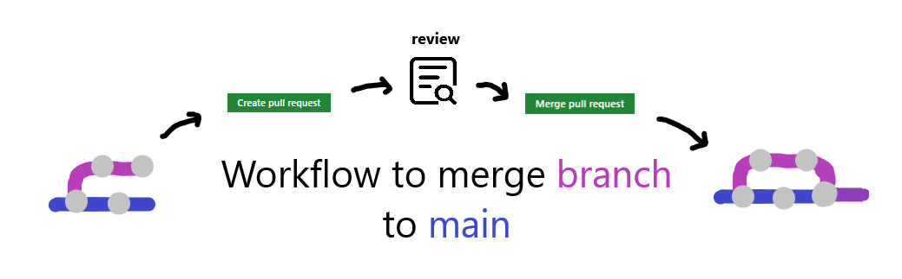
```


## (Re)Sources

Congrats! We have made it to the end of today's session :) We know that github can be a bit confusing conceptually, but we hope you can use this workbook and the resources below to help you reference problems in the future! We will also be hosting our next R Work session December 21 from 1-3pm to go over more questions or issues! 

  - [Link to Join Github](https://github.com/join)
  - [How to Create a GitHub Account](https://www.wikihow.com/Create-an-Account-on-GitHub)
  - [R Advisory Group Resources](https://doimspp.sharepoint.com/sites/nps-nrss-imdiv/SitePages/R-Adv.aspx) Monitors and manages the release of R, RStudio and Git in the NPS Software Center. The Advisory Group can help with installation and configuration issues.
  - [Happy Git and GitHub for the useR](https://happygitwithr.com/index.html)
  - [Version Control IMD Training](https://katemmiller.github.io/IMD_R_Training_Advanced/)
  - [GitHub Git Cheat Sheet](https://training.github.com/downloads/github-git-cheat-sheet/)

# {-}
